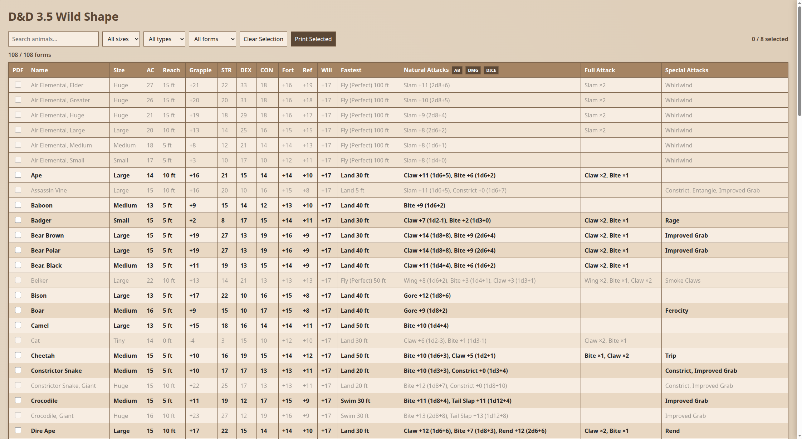
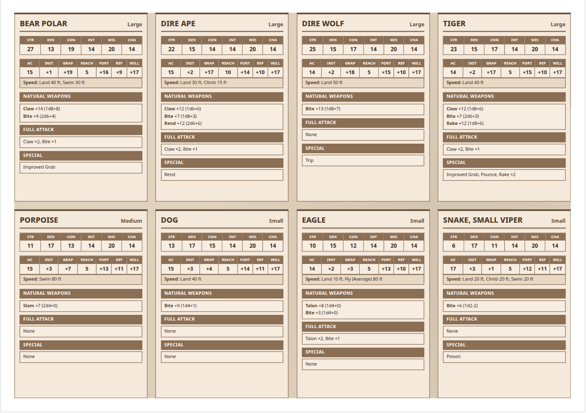

# WildShape Calculator

A C and browser tool for generating Dungeons & Dragons 3.5 wild shape forms.

Configure the druid in [`src/hero_specs.h`](src/hero_specs.h). The C program combines those settings with the creature catalog, calculates the resulting combat statistics, and writes `wildshape.json`. The browser UI in [`index.html`](index.html) reads that generated file and provides a searchable table, detailed stat views, and a printable cheat sheet that can be saved as PDF.

> This is an unofficial fan project. It is not affiliated with or endorsed by Wizards of the Coast. See [License](#license) for the scope of the code and game-data licenses.

## Screenshots

### Wild shape table



### Printable cheat sheet



A generated example is available as [`CheatSheet.pdf`](CheatSheet.pdf).

## Features

- Calculates level-appropriate wild shape eligibility from hit dice, creature type, and size.
- Calculates ability modifiers, initiative, base attack bonus, grapple, saving throws, movement, and natural, full, and special attacks.
- Keeps the base creature data in the C catalog and exports the calculated forms to `wildshape.json`.
- Provides a browser table with search, size/type/eligibility filters, sorting, and detailed form views.
- Selects up to eight forms for a compact A4-landscape cheat sheet.
- Prints directly from the browser or saves the selected forms as a PDF.

## Requirements

- GNU Make
- A C17 compiler, such as GCC or Clang
- Git with the repository submodules initialized
- Python 3, or another local static web server, for the browser UI
- A modern browser with printing support

## Quick start

Initialize the submodules, build the calculator, and generate the JSON file:

```bash
git submodule update --init --recursive
make
make run
```

`make run` prints the calculated forms and writes `wildshape.json` in the project root. The executable is also available at `build/bin/WildShapeCalculator`.

Because `index.html` loads `wildshape.json` with `fetch()`, serve the project over HTTP rather than opening the file directly with a `file://` URL:

```bash
python3 -m http.server 8000
```

Then open [`http://localhost:8000/index.html`](http://localhost:8000/index.html).

## Configure the druid

The calculator takes the character profile from [`src/hero_specs.h`](src/hero_specs.h):

| Macro | Purpose |
|---|---|
| `DRUID_LV` | Druid level |
| `HERO_INT` | Intelligence score |
| `HERO_WIS` | Wisdom score |
| `HERO_CHA` | Charisma score |
| `EXTRA_FORT` | Additional Fortitude save bonus |
| `EXTRA_REF` | Additional Reflex save bonus |
| `EXTRA_WILL` | Additional Will save bonus |

These are compile-time settings. Change the values, run `make run` again, and refresh the browser to regenerate the results.

## Browser and PDF workflow

1. Run the calculator with `make run` so `wildshape.json` is current.
2. Serve the repository and open `index.html`.
3. Search or filter the table, then click a row to inspect its full statistics and notes.
4. Use the `PDF` checkboxes to select up to eight forms.
5. Click **Print Selected**.
6. In the browser print dialog, choose **Save as PDF** to keep a copy of the cheat sheet.

The print layout is designed for A4 landscape paper and arranges the selected forms in a four-column, two-row grid.

## Build and test

```bash
make            # build build/bin/WildShapeCalculator
make -j4        # parallel build
make test       # build and run the Unity tests
make test-build # build the test binary only
make clean      # remove build artifacts
```

The test executable is `build/bin/test_WildShapeCalculator`. The repository uses GNU Make rather than the old CMake template workflow.

## Project layout

```text
.
├── src/
│   ├── hero_specs.h       # Druid level, scores, and extra saves
│   ├── calculator/        # Wild shape stat calculations
│   ├── creatures/         # Creature catalog and data types
│   ├── json/              # JSON export support
│   ├── table/             # Text output support
│   └── main.c             # Program entry point
├── tests/                 # Unity test runner and tests
├── index.html             # Browser table and print interface
├── wildshape.json         # Generated calculator output
├── Makefile               # Build and test targets
├── Examle_Table.png       # Table screenshot
├── Example_CheatSheet.png # Cheat-sheet screenshot
└── CheatSheet.pdf         # Sample generated PDF
```

## License

The project code is released under the MIT License. See [`LICENSE`](LICENSE).

The bundled creature statistics and descriptive game data are derived from the D&D 3.5 System Reference Document and are Open Game Content made available under the [Open Game License Version 1.0a](https://d20.odk.com/SRD/legal.html). Preserve the license and its attribution/copyright notice when redistributing that Open Game Content.

The Open Game License does not grant rights to Product Identity or trademarks. Dungeons & Dragons, D&D, and related names and marks remain the property of their respective owners.
